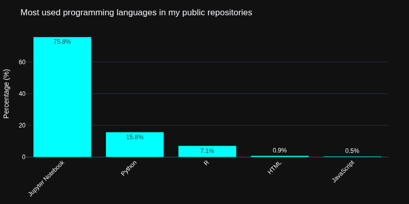
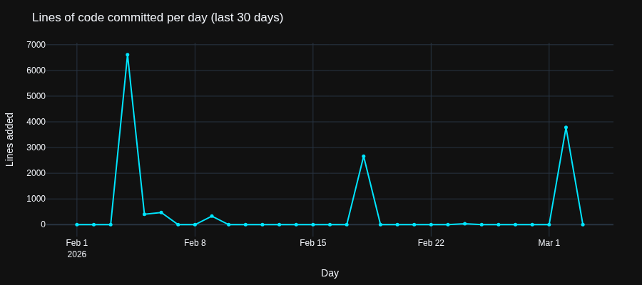

<h1 align="center">👋 Hi, I'm Olivier BOROT</h1>
<h3 align="center">Data Scientist - Data Engineer - Data Analyst</h3>

---

## 🚀 About Me
- 💼 SISE (Data Science) Master 2 Student at Université Lyon 2
- 🔭 Cinema, building useless things to make my life a bit easier, and cinema
- 🤖 Passionate about beautiful code, machine learning and everything else on Earth.
- 📫 Personal: [✉️ olivier.dominique.borot@gmail.com](mailto:olivier.dominique.borot@gmail.com)
- 💼 Professional: [🏢 olivier.borot@univ-lyon2.fr](mailto:olivier.borot@univ-lyon2.fr)
- 🔗 LinkedIn: [Olivier BOROT](https://www.linkedin.com/in/olivier-borot)
- 📄 CV: [Link to my CV]()

## ⚙️ Most Used Languages

  

---

### 📊 GitHub Stats:
 
 

---

<!--DYNAMIC_SECTION_START-->
### ⏱ Latest Repositories
- [OlivierBOROT](https://github.com/OlivierBOROT/OlivierBOROT) – updated 2026-01-25
- [Projet-ATLAS](https://github.com/OlivierBOROT/Projet-ATLAS) – updated 2026-01-22
- [SISE_FraudAnalysis](https://github.com/OlivierBOROT/SISE_FraudAnalysis) – updated 2026-01-15
- [M2_R_Clustering_Shiny_App](https://github.com/OlivierBOROT/M2_R_Clustering_Shiny_App) – updated 2025-12-13
- [M2-Projet-ENEDIS](https://github.com/OlivierBOROT/M2-Projet-ENEDIS) – updated 2025-11-04

### 📊 Most Active (by commits)
- [M2-Projet-ENEDIS](https://github.com/OlivierBOROT/M2-Projet-ENEDIS) – 0 commits
- [M2_R_Clustering_Shiny_App](https://github.com/OlivierBOROT/M2_R_Clustering_Shiny_App) – 0 commits
- [OlivierBOROT](https://github.com/OlivierBOROT/OlivierBOROT) – 0 commits
- [Projet-ATLAS](https://github.com/OlivierBOROT/Projet-ATLAS) – 0 commits
- [SISE_FraudAnalysis](https://github.com/OlivierBOROT/SISE_FraudAnalysis) – 0 commits

### 📈 Lines of Code Committed Per Day

<!--DYNAMIC_SECTION_END-->

---

### 🔥 Contribution Graph

  

---
