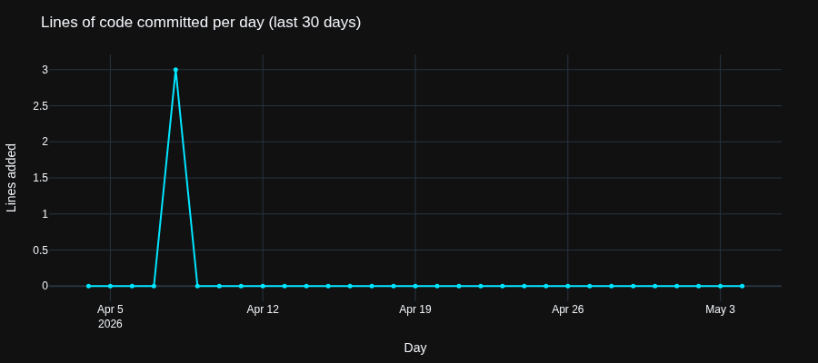

<h1 align="center">👋 Hi, I'm Olivier BOROT</h1>
<h3 align="center">Data Scientist - Data Engineer - Data Analyst</h3>

---

## 🚀 About Me
- 💼 SISE (Data Science) Master 2 Student at Université Lyon 2
- 🔭 Cinema, building useless things to make my life a bit easier, and cinema
- 🤖 Passionate about beautiful code, machine learning and everything else on Earth.
- 📫 Personal: [✉️ olivier.dominique.borot@gmail.com](mailto:olivier.dominique.borot@gmail.com)
- 💼 Professional: [🏢 olivier.borot@univ-lyon2.fr](mailto:olivier.borot@univ-lyon2.fr)
- 🔗 LinkedIn: [Olivier BOROT](https://www.linkedin.com/in/olivier-borot)
- 📄 CV : [link to my CV](OLIVIER_BOROT.pdf)

---

### 🔥 Contribution Graph

  

---

<!--DYNAMIC_SECTION_START-->
### ⏱ Latest Repositories
- [OlivierBOROT](https://github.com/OlivierBOROT/OlivierBOROT) – updated 2026-03-07
- [SISE-Challenge-WebMining](https://github.com/OlivierBOROT/SISE-Challenge-WebMining) – updated 2026-03-06
- [Challenge-Security](https://github.com/OlivierBOROT/Challenge-Security) – updated 2026-03-04
- [SISE_satelitar_identifier](https://github.com/OlivierBOROT/SISE_satelitar_identifier) – updated 2026-03-03
- [SISE_WNN_implementation](https://github.com/OlivierBOROT/SISE_WNN_implementation) – updated 2026-02-05

### 📊 Most Active (by commits)
- [Challenge-Security](https://github.com/OlivierBOROT/Challenge-Security) – 0 commits
- [M2-Projet-ENEDIS](https://github.com/OlivierBOROT/M2-Projet-ENEDIS) – 0 commits
- [M2_R_Clustering_Shiny_App](https://github.com/OlivierBOROT/M2_R_Clustering_Shiny_App) – 0 commits
- [OlivierBOROT](https://github.com/OlivierBOROT/OlivierBOROT) – 0 commits
- [Projet-ATLAS](https://github.com/OlivierBOROT/Projet-ATLAS) – 0 commits

### 📈 Lines of Code Committed Per Day

<!--DYNAMIC_SECTION_END-->
